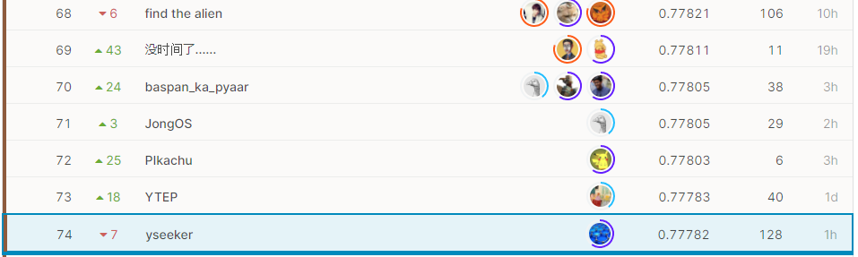
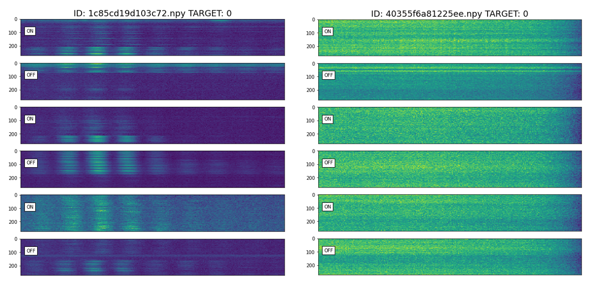
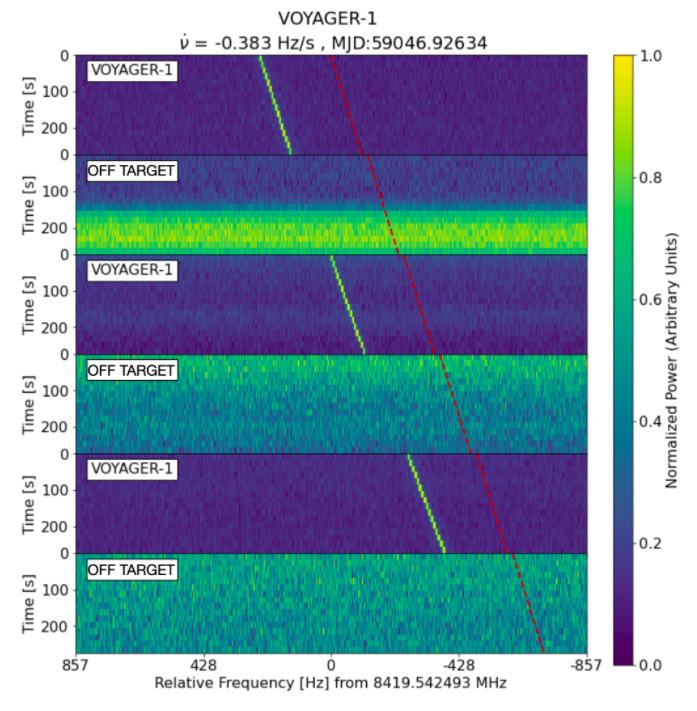

# SETIコンペ参加記

[SETI Breakthrough Listen - E.T. Signal Search](https://www.kaggle.com/c/seti-breakthrough-listen/overview)というKaggleの**画像分類コンペ**に参加しました。

## 結果

774チーム中74位でソロ銅でした。

## コンペの概要

[Overviewのページ](https://www.kaggle.com/c/seti-breakthrough-listen/overview)には
> In this competition, use your data science skills to help **identify anomalous signals in scans of Breakthrough Listen targets**. Because there are no confirmed examples of alien signals to use to train machine learning algorithms, the team included some simulated signals (that they call “needles”) in the haystack of data from the telescope. They have identified some of the hidden needles so that you can train your model to find more. 

とあって、要するにSETI（Search for Extra Terrestrial Intelligence；地球外知的生命体探査）の研究グループ（Listenチーム）が取得した大量の望遠鏡の信号のデータ（2次元データ）をシミュレーションによって生成した擬似的な地球外知的生命体からの信号（needle）があるデータ（Positive）と無いデータ（Negative）に分類し、そのAUCスコアを競うコンペです。地球外知的生命体からの信号発見用の機械学習アルゴリズムを開発するという何ともロマンのあるコンペです。

コンペで使用するデータの例をNegative, Positiveで2つずつ挙げると（縦軸は時間、横軸は周波数）

のようになっており、たしかにPositiveデータの方にはneedleらしい特徴が視認できます（赤矢印）。上のデータはわかりやすいデータをあげましたが、実際には少なくとも目で見る限りはNeedleらしい特徴なんてどこにもないPositiveデータもたくさんありました。実際の観測データでは、望遠鏡を信号を発する方向に向けた際のデータをONデータ、別の方向に向けた際のデータOFFデータとしているため、今回のデータではPositiveのONデータにのみシミュレーションによって生成した擬似的なneedle（信号）をうまく混ぜてあるようです。

## 参加記

### 2021年6月
*  本業に余裕ができたので5年ぶりにKaggleを真面目にやりたいと思い立つ。画像コンペに参加したことが無かったので、画像コンペを中心に漁り始める。SIIMとSETIの2つのコンペを発見した。最初にSIIMをやり始めたが、厳しそうだったのですぐに撤退。
*  Kagglerたちは皆Pytorchを使っているようなのでPytorchを勉強し始めた。深層学習もすっかり忘れていたので復習した。
*  世の中にはtimmという神ライブラリがあることを知り、転移学習を覚えた。
*  とりあえずPytorchで一通り書けるようになりまともなスコアが出るようになったので、公開カーネルとディスカッションを読みはじめる。
*  4xGrandmasterの[@abhishek](https://www.kaggle.com/abhishek)さんが作った[Tez](https://github.com/abhishekkrthakur/tez)というエコシステムを知り、これを利用しつつ、自分で一からエコシステムを作ったりしてPytorchの理解を深めた。
*  mixupというdata augumentationを知る。

### リーク発覚
*  ローカルに落としたファイルのtime stampなどから正解ラベルが特定できる[リークが発覚](https://www.kaggle.com/c/seti-breakthrough-listen/discussion/246772)＝＞3-4週間後にコンペ再スタート

### 2021年7月
* [@ttahara](https://www.kaggle.com/ttahara)さんが公開されていた[pytorch-pfn-extra](https://github.com/pfnet/pytorch-pfn-extras)を使った[Code](https://www.kaggle.com/ttahara/rerun-seti-e-t-resnet18d-baseline)を発見して、便利さに感動したが、web上にpytorch-pfn-extraの説明があまりなく、すべての解読はまだできていない。
* *mixupのalphaを0.5から1.5に変えるとefficientnetb0でPublic scoreが0.760から0.766に上がった。
* 何もいいアイディアが思い浮かばないので、データの加工（標準化、正規化）、モデルの変更（efficientnet family, resnet family, vgg16bn, mobilenet）などを試すがあまり劇的な効果は得られなかったが、efficientnetb3が若干良いスコアを出すことが分かった。
* これまでのモデルのスコアをアンサンブルをしたら一時期15位くらいまで上昇した（残り1ヶ月）
  
### 2021年8月
* TTA, アンサンブル、スタッキングなどを試す。TTAしてからアンサンブルするとTTA無しのアンサンブルよりもスコアが下がって謎だった。
* スタッキングを試すがPublic scoreで0.780を超えない。
* ラスト3日で銀圏から銅圏に追い出される。
* 最後にスタッキングのモデルも含めた15個くらいのモデルをアンサンブルして終了。

## 上位陣の解き方
### 1位　Watercooled ()
### 2位　Watercooled ()

