# 実際の実験内容

## Broida Hall (物理学棟)
Broida Hallは物理学科の建物でにここに各研究室の居室や実験室などが全て入っている。
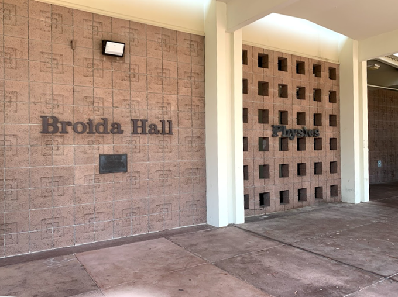
実験室の近く。実験室の扉を開けるとすぐ外に出る。液体窒素などの汲み場はすぐ近くにあり、便利である。
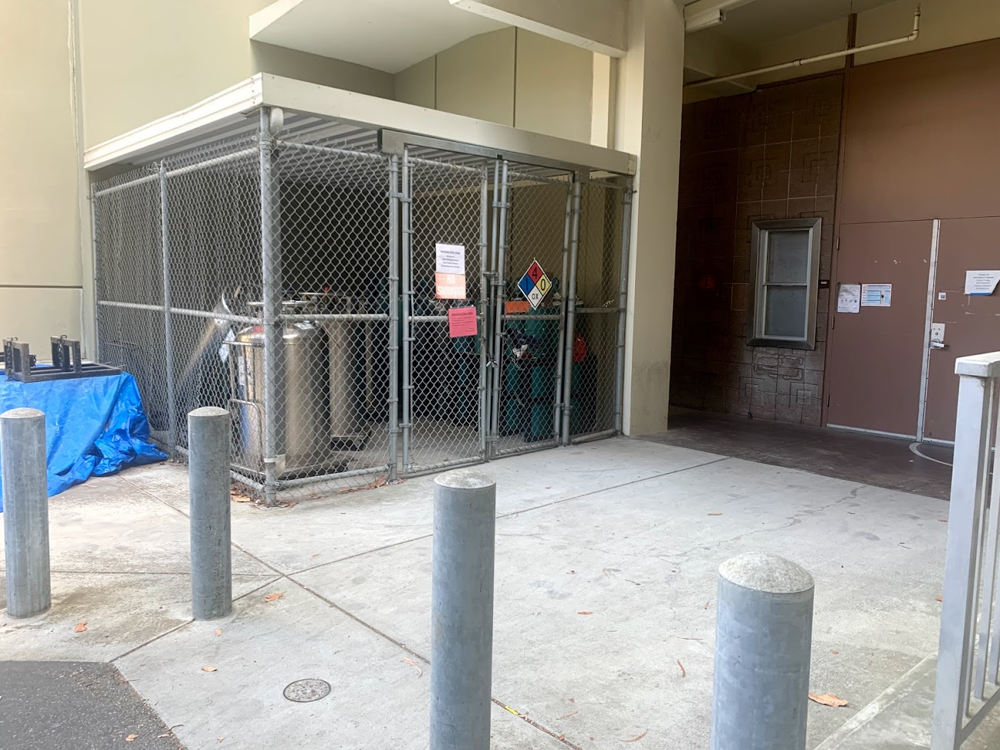
居室。窓が無いのが欠点。
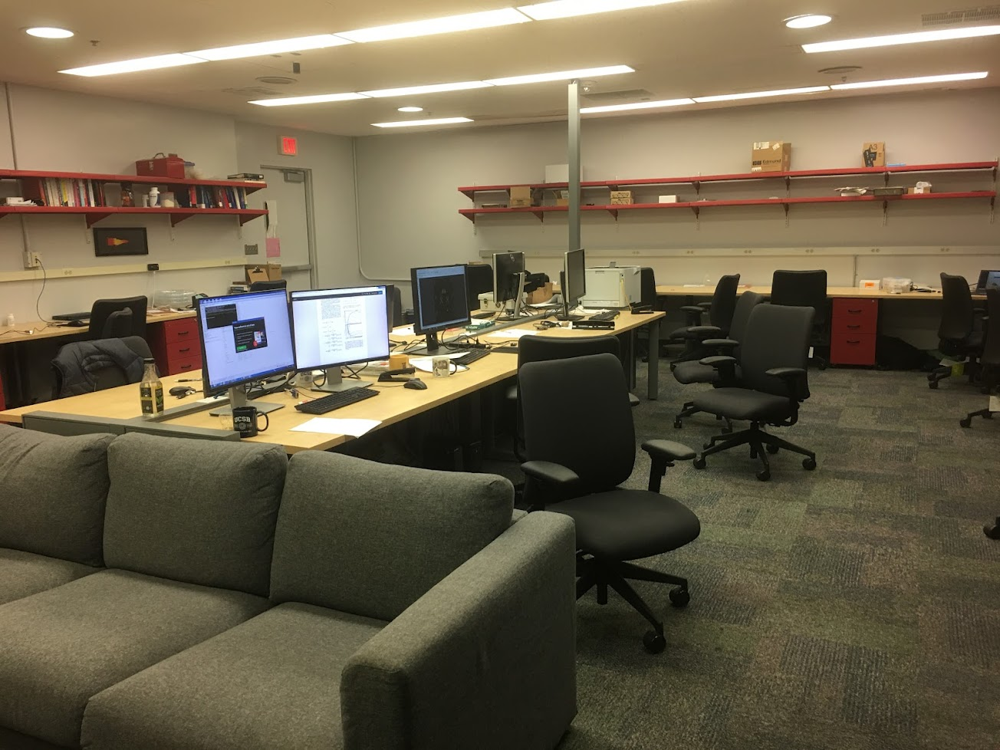

## サンプル作製と測定
### サンプルの作製
実験では、まずスコッチテープ法という手法（[2010年ノーベル物理学賞](https://www.nobelprize.org/prizes/physics/2010/press-release/)）でグラファイトや六方晶窒化ホウ素などを劈開してそれらの原子層（ナノメートルスケールの厚さ）を準備する。これらを積層する（重ねる）ことでサンプルを作製する。私の研究では各層の結晶方位に対する相対角度を制御して積層する。

- スコッチテープ法に関して
https://www.youtube.com/watch?v=rphiCdR68TE
- 原子層の転写に関して
https://www.youtube.com/watch?v=XPCiEhQGkbE

実際の原子層の光学顕微鏡の写真。右から六方晶窒化ホウ素、グラフェン、六方晶窒化ホウ素。これらを積層するとその下の写真になる。
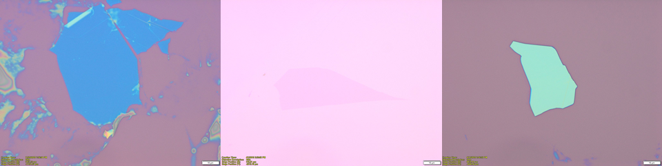
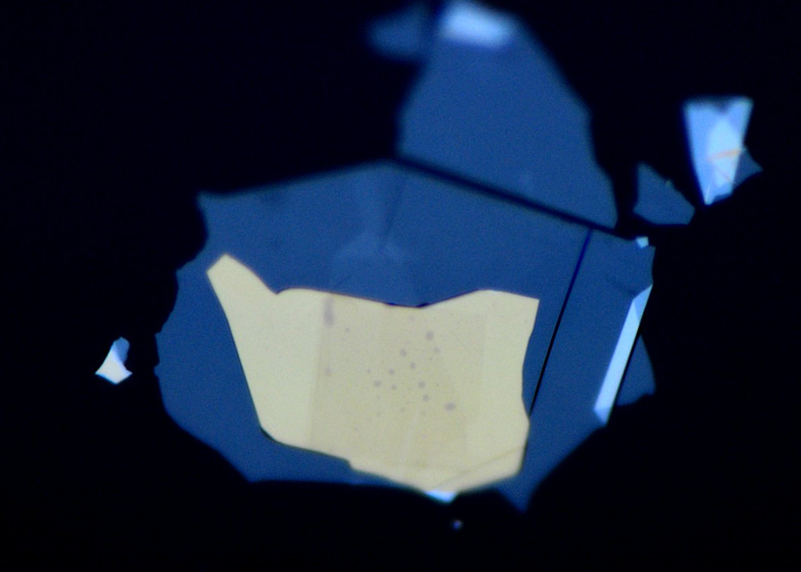

### デバイス加工
サンプルをデバイスに加工する。これらの操作はキャンパス内の共同利用施設であるクリーンルーム([UCSB Nanofabrication Facility](https://www.nanotech.ucsb.edu/))で行う。企業なども利用でき（ただしかなり高額）、例えばGoogleの量子コンピュータ部門（サンタバーバラ近くのGoletaにある。）もハードウェアの部品の作成などに利用している。クリーンルーム内の装置（主に走査型電子顕微鏡、Etching装置、蒸着装置）を利用して、上記の積層したサンプルをデバイスに加工していく。
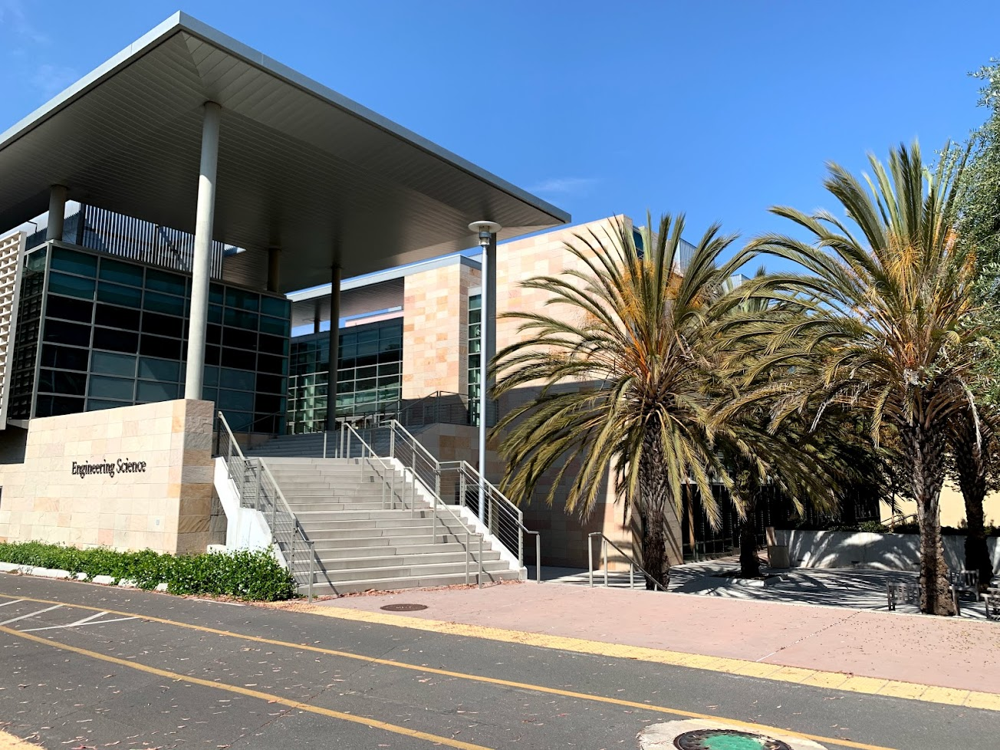
クリーンルーム内
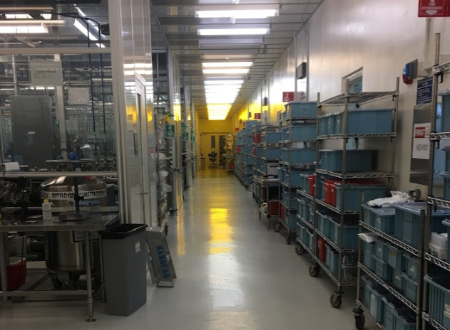
Wet bench：試薬の使用など。
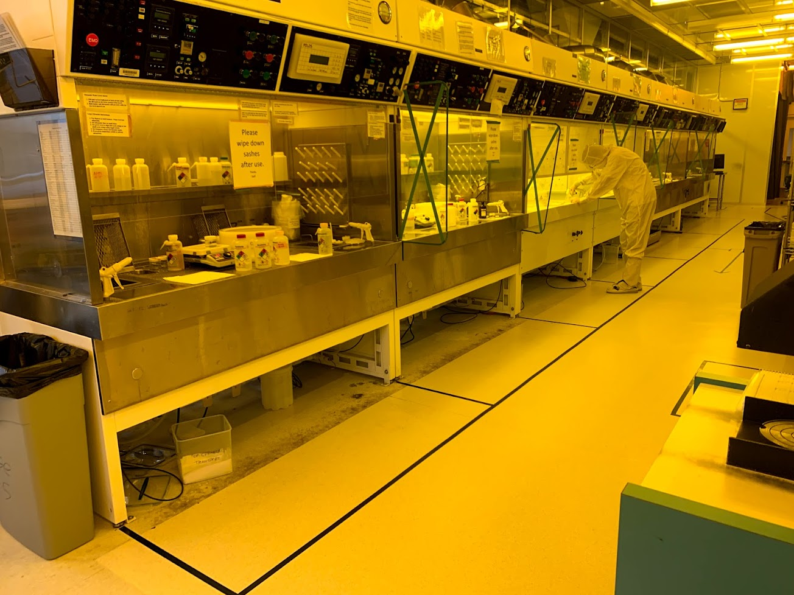
走査型電子顕微鏡: デバイスのデザインのパターニングに使用。
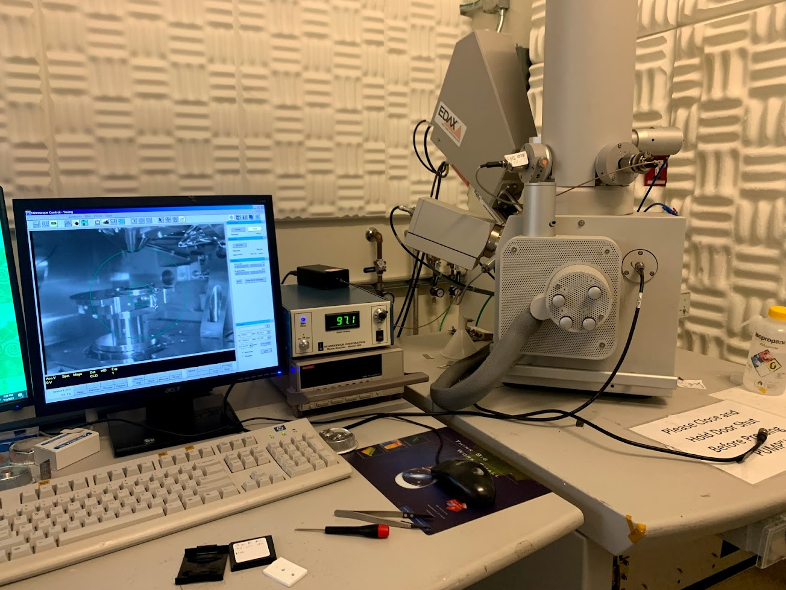
電子ビーム蒸着装置：電極の作成に使用。
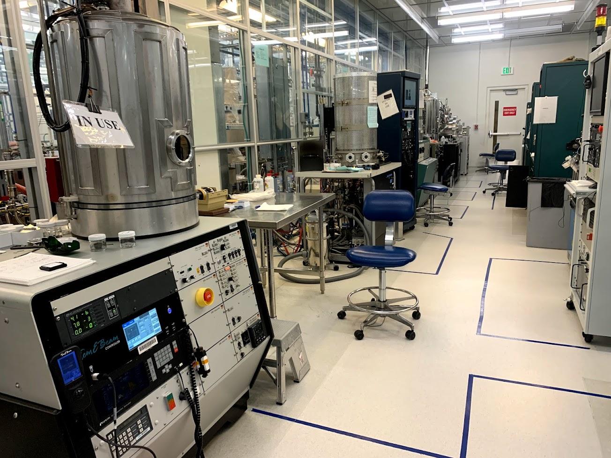

完成したデバイスの例がこちら。実際にどのように電極がデバイスに電気的に接しているかは[こちらの論文](https://science.sciencemag.org/content/342/6158/614)を参照。
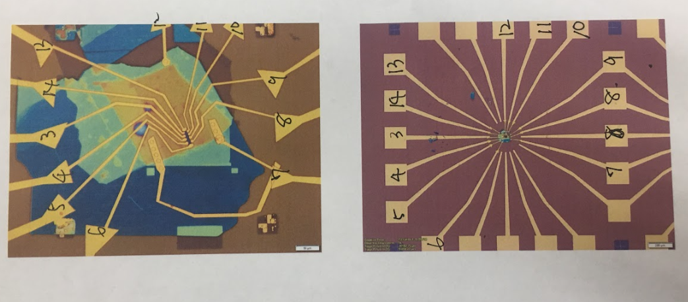

### 測定
デバイスが実際に測定可能か、つまり最低限電気的にコンタクトがとれているか、ゲートがリークしていないかをプローブステーションでチェックする。
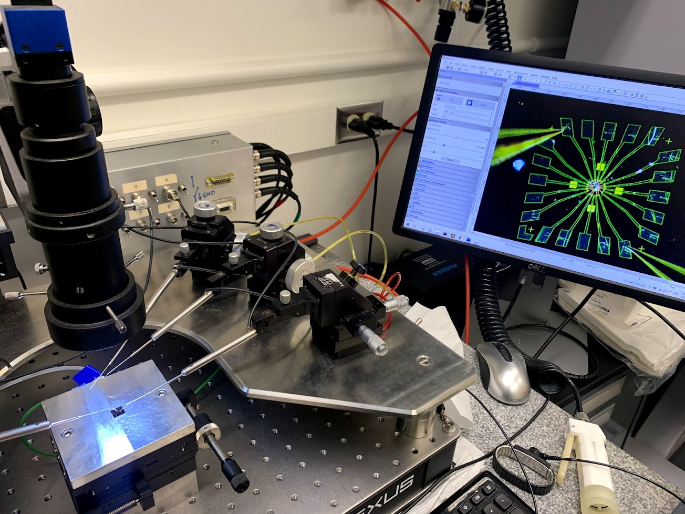

冷凍機に入れるためにまずこのような冷却用プローブの先端にサンプルを設置する。
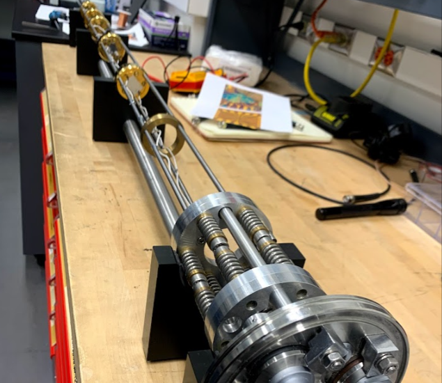

希釈冷凍機（写真左側の大きい白い円筒状のもの）で最低温度10mK（つまりセルシウス度で-273.14℃、絶対零度よりも0.01℃だけ高い）まで冷却し、サンプルの特性、例えば電気抵抗値や量子キャパシタンスなどを測定する。希釈冷凍機の仕組みは[こちら](https://www.sci.osaka-cu.ac.jp/phys/ult/invitation/cryo/dr.html)。冷凍機や測定装置の制御には[LabRAD](https://ys-blog.hatenadiary.com/entry/2021/05/09/130917)を用いていた。
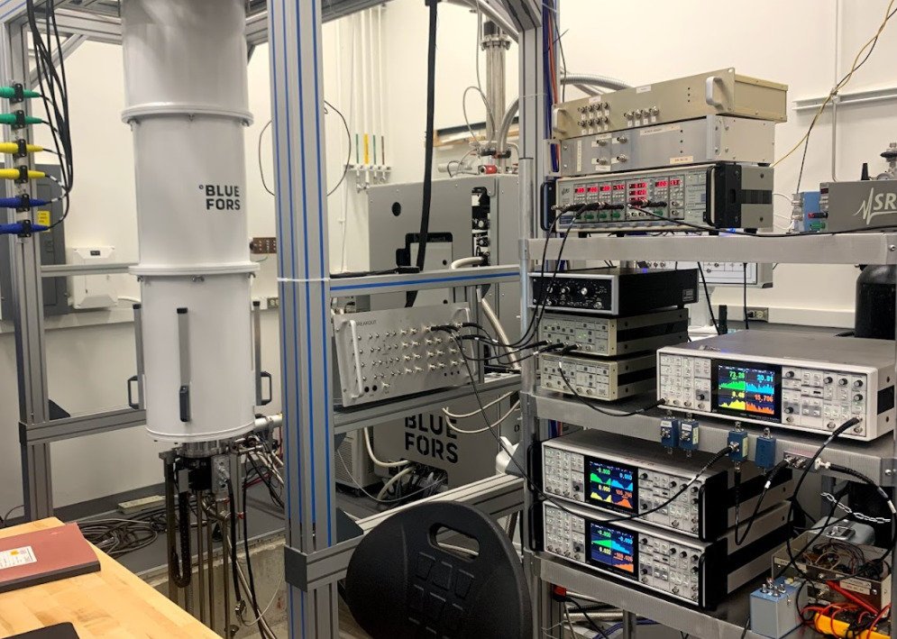

そこまでの低温が必要ない場合は液体ヘリウム（＋減圧）を用いて、1.5Kまで冷却して測定を行う。希釈冷凍機が最低温度10mKまで10時間程度かかるのに対して、こちらは2-3時間で最低温までいくことができる。写真の冷凍機は今のラボができる前にこの実験室を使用していたラボが数十年前に購入し使用していた（古代の）冷凍機でメンテナンスが大変である。
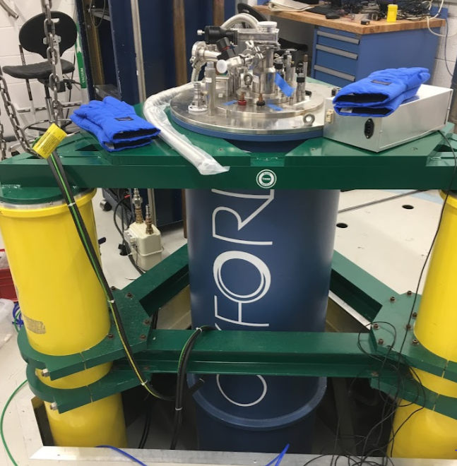
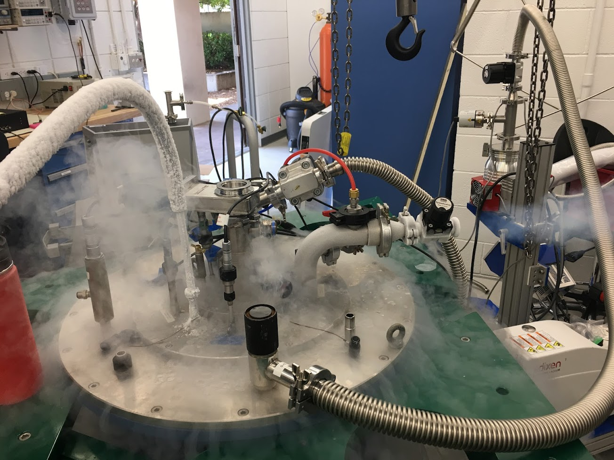

## 研究テーマと論文
UCSBでは、twisted2層グラフェンという2枚のグラフェンをある特定の角度（1.1度）だけずらして積層させた構造の低温における量子現象の研究を行っていた。

**関連ビデオ**：https://online.kitp.ucsb.edu/online/bands-oc20/young/rm/jwvideo.html

**論文**

* Y. Saito et al. [*Nature Physics* **16**, 926-930 (2020).](https://www.nature.com/articles/s41567-020-0928-3) ([arXiv PDF](https://arxiv.org/pdf/1911.13302.pdf))
* Y. Saito et al. [*Nature Physics* **17**, 478-481 (2021).](https://www.nature.com/articles/s41567-020-01129-4) ([arXiv PDF](https://arxiv.org/pdf/2007.06115.pdf))
* Y. Saito et al. [*Nature* **592**, 220-224 (2021).](https://www.nature.com/articles/s41586-021-03409-2) ([arXiv PDF](https://arxiv.org/pdf/2008.10830.pdf))
