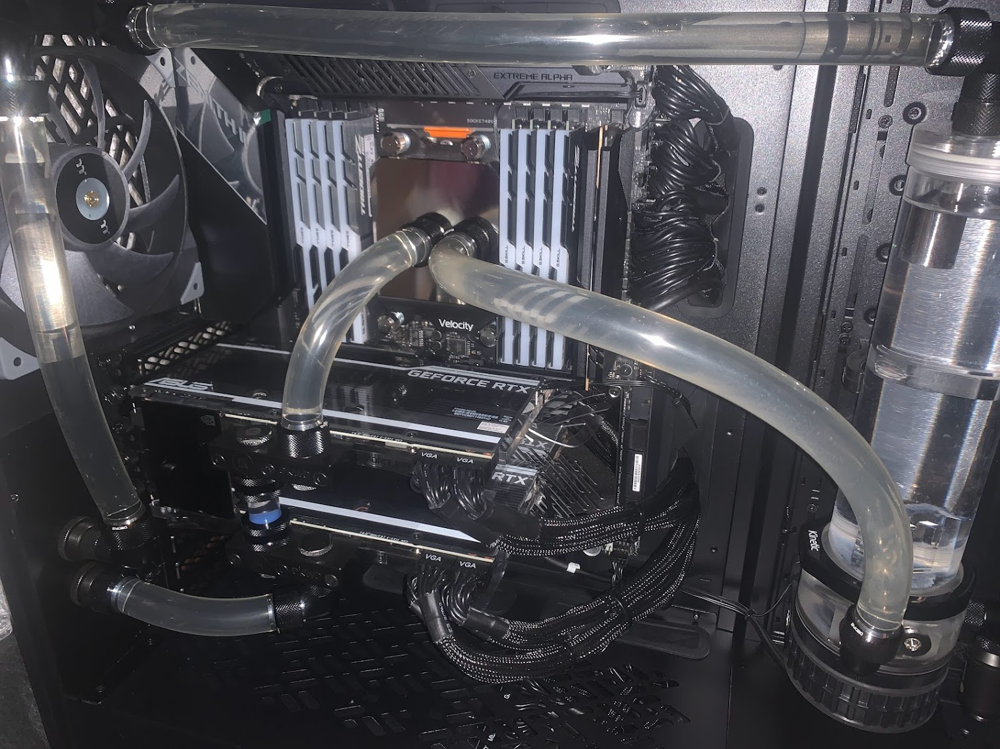
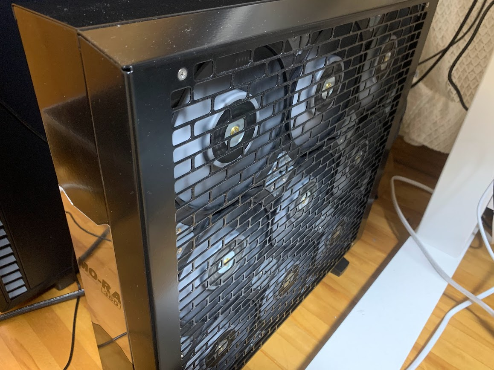

機械学習の分野、特に深層学習の分野だと GPU がないとかなり厳しいので自宅にオンプレ GPU マシンが前々から欲しかったが、アメリカでポスドクをしていたこともあり、本帰国してから導入すればいいやと思っていた。

GCP や Azure の VM インスタンスは V100x2 とかで運用すると長期的にはかなりコストがかかるし、Colab Pro, Pro+は、コスパはとても良いが割当 GPU のランダム性やデータを一々配置し直す必要があるのが面倒くさい。そもそもいつまでサービスが続くかも分からない。
とはいっても GPU でちょっと遊ぶくらいなら Colab は間違いなく便利なサービスだと思う。

[Lambda PC（GPU Workstation）](https://lambdalabs.com/gpu-workstations/vector)なども検討したが、RTX3090 をフルで回したらファンの音が煩そうなので本格水冷の GPU マシンが欲しいと思っていた。ただそうはいっても自作できる技量はないので、大枚はたいて各種パーツを購入し、[MOMA GARAGE](https://moma-garage.com/)さんにお願いし、本格水冷の GPU マシン を組み立ててもらった。（門馬さん、ありがとうございます！）

組み立て後の PC の中身

MO-RA3 360 PRO (冷却用ラジエーター)

## 主なパーツ

- マザーボード : ASUS ROG Zenith II Extreme Alpha
- CPU : Ryzen Threadripper 3970X
- GPU : ASUS EKWB RTX3090 24GB GDD6X
- RAM メモリ : G.Skill F4-3200C 16D-32GTZRX
- SSD : SAMSUNG 980 PRO MZ-V8PT0B
- 冷却用ラジエーター 1 : Watercool MO-RA3 360 PRO stainless steel
- 冷却用ラジエーター 2 : Black Ice Nemesis 480GTS
- CPU ウォーターブロック : EK WaterBlocks EK-Quantum Velocity sTR4 D-RGB - Full Nickel

## 本格水冷の効果

RTX3090 ２枚をフルで回しても、`nvidia-smi` で確認する限りは **45 度**くらいまでしか GPU の温度は上昇しなかった。空冷だと経験上 65-70 度くらいまで上昇するので、水冷の冷却効果が極めて高いことが分かった。

## 今後の抱負

家で GPU を眠らせることのないように Kaggle とかその他の趣味で積極的に使っていきたい。
