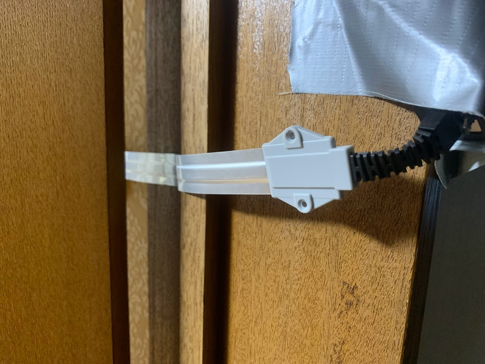

## RT-AX86U の導入

日本に本帰国してから家の Wi-Fi の環境を快適にしたいと考えてを ASUS の RT-AX86U を導入した。NURO 光の ONU に加えるので二重ルータになることになるが下記の記事を参考に設定すると問題なくルーターとして機能させることができた。時間帯にもよるが、上りも下りも 500-700Mbps くらい出た。ちなみに NURO 光の ONU は F660A である。

### 参考

- https://digitalnetlife.com/asus-wifi6-nuro-internet/
- https://raife.jp/network-router-rtax86u-f660a/

ゲーミング LAN ポートで有線接続すると、700-900Mbps くらい出て自宅サーバーへの `scp` や `rsync` でのファイル転送も、80-90MB/s くらいで快適にできるようになった。

## ドアの隙間から有線 LAN を通す。

上で導入した RT-AX86 は部屋の外においてあるので、なんとか部屋の中にあるサーバーに有線 LAN を通したいということでドアの隙間から通せるエレコム [LAN ケーブル 0.4m 隙間 CAT6A 準拠 シルバー LD-VAPF6A/SV04](https://amzn.to/3iFEG1I) を購入した。写真の通り、ドアの隙間から LAN を通すことに成功し、700-900Mbps を維持することができた。

