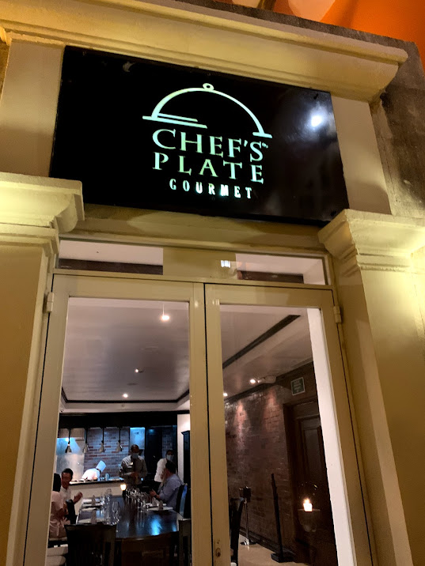
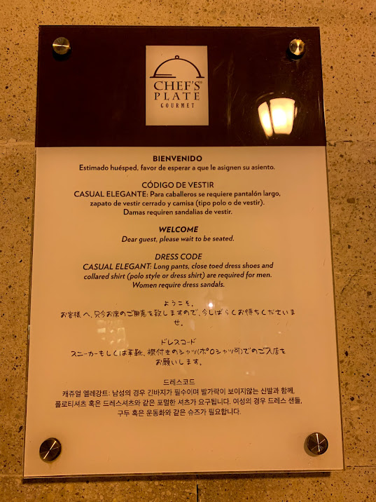

アメリカ生活最後の思い出として、妻とメキシコのカンクンへ旅行に行った。
宿泊したホテルはハイアット・ジラーラという所で年齢制限があるため子供は宿泊できない大人オンリーの空間である。ホテル内のプールから望むカリブ海は絶景だった。
オールインクルーシブプランのためホテル内のレストランであればどこでも食べ放題でとても豪華なひとときを過ごした。

午前１１時くらいからホテル中央のバーでお酒も飲み放題になる。

アジア料理店アシアナとメキシコ料理店マリアマリエ

インターナショナルビュッフェのスパイス。朝食はだいたいここで食べた。

シェフズプレート。豪華なコース料理を頂いた。

VELTRA のツアーを使ってマヤ文明やセノーテの観光にも行った。ガイドの MAMI さんにはとてもお世話になった。

チチェンイッツァ遺跡

セノーテ スイトゥン

セノーテ イキル

セノーテイキルのお土産屋で買える珍しい蜂蜜酒

