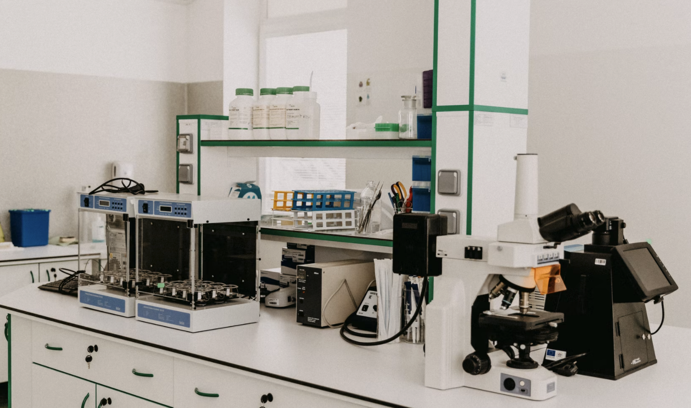

## 一般論

人生は生きてるだけで丸儲けである。生き続けるためには心身を健康に保つことが大切である。したがって、ラボ選びで重要なのは、国内国外限らず心身を健康に保てることができるラボを選ぶことである。特に心理的安全性が保障されているラボを選ぶことが重要であると思う。そんなこと当たり前じゃないかと思う人も多いかもしれないが、当たり前と思っていても実行できないのが人間である。ラボ選びは人生を左右するといっても過言ではないと思う。（さてこんなことを冒頭から偉そうに書いている自分は心身の健康を気にしてラボを選んだのかと言われると後述の通り全くそんなことはないので、私も人間であるし、全くもって説得力がない。）アカハラやパワハラが存在すると予めわかっているならばそういうラボは避けたほうが良いのは言うまでもない。あからさまなアカハラやパワハラが存在しなくともボスやスタッフとの相性が悪く、精神的に来る場合もあるので難しいところである。ある人にとってベストな上司が別の人にとってベストな上司とは限らない。

photo by Trnava University on [Unsplash](https://unsplash.com/)

次に実験系のラボの場合（ここでいう実験系というのは研究がパソコンだけで完結せず、試薬や生物、大規模な実験装置、ロボットなどを用いる分野を指す）は、なるべく研究設備が整っていて、可能な限り研究費が潤沢なラボを選ぶほうが良い。研究設備とお金が潤沢にあればやりたいことはだいたいなんでもできる。時々研究テーマ"だけで"ラボを選ぶ人を見かけるが、研究テーマだけでラボを選んでも、そもそもそのテーマをやらせてもらえないかもしれないし、研究設備とお金がなければ研究の土俵に立てないかもしれないし、研究の興味が時間とともに変わるかもしれない、のであまりおすすめはしない。（理論系のラボの場合は研究テーマ重視で選んでも問題ないと思う。）研究テーマに関しては"興味がある"あるいは少なくとも"興味がなくはない"くらいでスクリーニングして、あとはなるべく研究設備が整っていてと研究費がたくさんあるラボに行くほうが多くの経験を積めると思う。

さて以下の 2 つはオプショナルである。上で書いたことに比べたら些細な違いなのであまり気にしなくていいと個人的に思う。

- 大規模な研究室（例えば 20 人以上、この辺の感覚は分野によって違うと思う）か小規模な研究室（5 人くらい？）：どちらも一長一短で英語で検索するとこの手の議論がたくさん出てくるので興味があれば読むと良いといいと思う。

- いわゆる大御所のラボか立ち上げ直後のラボ：これもラボの立ち上げに関わりたいかそうでないかによる。ちなみに大御所のラボにいっても必ずしも成果が出るとは限らない。成果を出したいなら（そのラボからの）成果が直近でたくさん出ているラボに行ったほうが良いと思う。

## 海外ラボの場合

上記に加え、海外ラボの場合はなるべく非英語圏の特定の人種に偏っていないラボに行くことが重要だと思う。例えば中国人が 90％以上を占めるラボで使われる言語は間違いなく中国語だし、このようなラボに中国人以外の方が入って、数ヶ月や 1 年で去る話はいくつか聞いても、大活躍して論文を出しまくっている例は見たことも聞いたこともない。（もちろん中国語が堪能なら話は違う。）日本人に限らずこの点を見落とす人は意外にも多い。私はネイティブっぽいメンバーが半分以上いるところだけをラボ選びの際に探した。

## 自分の場合

### 学部＆大学院

私の出身の東大物理工学科では研究室選びは 4 年次の最初のじゃんけん大会（2012 年の話、現在はくじ引きらしい）で決まる。希望の研究室を黒板に書いて定員よりも多かったらじゃんけんをして決める。負けたら"相対的に"人気のない研究室に行くことになる。この毎年恒例のじゃんけん大会は、学科のイベントとして１年で最も盛り上がる日の 1 つだったのではないかと思う。私は当時研究テーマだけでラボを選び、運良くじゃんけんを制し、そのラボで学部 4 年から博士 3 年までの 6 年を過ごした。

### 海外ポスドク

photo by Gustavo Zambelli on [Unsplash](https://unsplash.com/)

アメリカに行くならカリフォルニア、研究するならカリフォルニア、住むならカリフォルニアという感じで圧倒的にカリフォルニアバイアスがかかった状態でラボ選びを行った。天気が良ければ全てハッピーくらいの能天気ぶりである。学部＆大学院時代のボスが当時 60 歳くらいの教授だったので、逆に独立から数年以内のラボに行ってみたかった。カリフォルニアという条件を除いても、自分の興味、独立から数年以内という条件、上記の通り人種の偏りが少ないという条件、現在成果を出している/これから成果を出しそうという"雰囲気を感じる"ラボはニューヨークに 1 つ、カリフォルニア・サンタバーバラに 1 つ（現在所属のラボ）しかなかった。ちなみに現在所属している UCSB のラボ（雰囲気を感じた方）は、当時ボスが独立から 2 年目のラボだったということもあり、私がメールで応募したとき（2017 年 8-9 月くらい）にはラボの出版論文は 1 つもなかったし、大学院時代のボスは現ボスのことを全く知らなかった。（大学院時代のボスからはコネのあるラボをいくつか紹介されたが、若手のラボではなかったか、もしくは上記の人種のバランスの条件を満たさなかったので、最優先の候補にはしなかった。）メールで応募し、スカイプインタビューなどをした数カ月後、運良く現地の研究機関から[Elings Prize Fellowship](https://www.cnsi.ucsb.edu/programs/elings-fellowships)というポスドクフェローシップを頂けることが決定し、現在所属のラボに行けることになった。当時は論文がまだ 1 本も出ていない立ち上げから間もないラボに行くことに一抹の不安を感じたが、"ええい、ままよ"式の意思決定は自分の人生経験上意外にも成功することが多いので、とりあえず出たとこ勝負という気持ちで行くことにして、念願のカリフォルニアでのポスドク生活が始まった。
