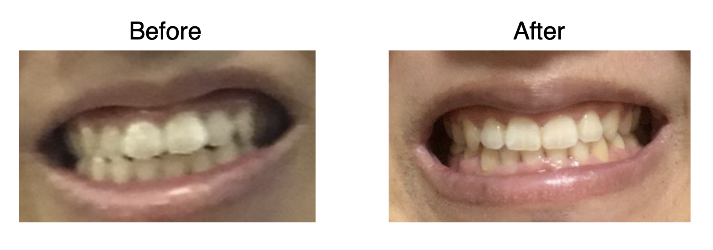

日本に本帰国して無事に継続で矯正治療を行ってくれる矯正歯科を発見し、矯正治療をつい先日終えることができた。記念に矯正治療前と治療後の比較画像を貼っておく。

矯正治療前は、上の前歯が 2 本前方にはみ出していてさらに、上の歯と下の歯が噛み合っていなかったが、上下４本抜歯をしてもらい、矯正治療を終えた結果、歯並びとかみ合わせが劇的に改善した。一方、下の前歯には若干ブラックトライアングル的なものができてしまったが、まあこのあたりは歯科矯正のトレードオフらしいので仕方がない。

## 結論

歯科矯正は人生を変える。
