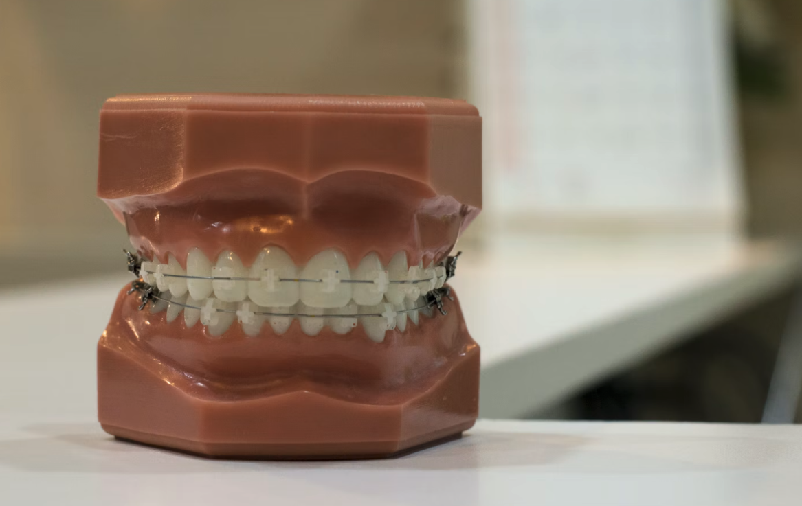

[以前の記事](https://www.yusaito.com/blog/posts/us-life/root-canal-treatment/)で書いた通り、私は渡米 3 ヶ月で歯の神経を抜いた。歯内療法科で専門医に歯の神経を抜いてもらった後に、すぐ隣の一般歯科の専門医に見てもらったのだが、その際に奥歯に過度な力が加わっているためこのまま放っておくと頭痛持ちになるかもしれないからどこかの矯正歯科に行ったほうが良いと言われた。当時は渡米直後ということもあり、仕事をするのに、もっと言えば生活していくのに精一杯だったためには華麗にスルーしてしまったのだが（金銭的にも余裕がなかった）、それから数ヶ月が経って一段落してやはり矯正歯科に行くことにした。お世辞にも健康で丈夫な体とは言えないので年をとってからの悩みの種を増やしたくなかったからである。それと矯正大国アメリカでの矯正を体験してみたかったというのも少しある。矯正歯科は、根管治療をしてくださった歯内療法科と一般歯科のすぐ近くにある[Santa Barbara Orthodontist](http://www.sborthodontics.com/)というところにした。これらの歯科医院は全て[Alamar Dental Center](https://www.google.com/maps/place/%E3%82%A2%E3%83%A9%E3%83%9E%E3%83%BC%E3%83%BB%E3%83%87%E3%83%B3%E3%82%BF%E3%83%AB%E3%83%BB%E3%82%BB%E3%83%B3%E3%82%BF%E3%83%BC/@34.4389881,-119.7240706,15z/data=!4m5!3m4!1s0x0:0xdc20bbc76f41883c!8m2!3d34.4390077!4d-119.7240401)に連なって存在している。これら以外にもあと 3 つくらい別の分野を専門とする歯科医院が存在している。

photo by Yingpis Kalayom on [Unsplash](https://unsplash.com/)

初回相談でレントゲン写真などをとってもらい（無料）、治療完了までの予想期間や費用、完成予想図などを説明された。さて米国での治療費は日本に比べてかなり高いと言われるが、その数少ない例外が歯科矯正の治療費だと思う。アメリカでの平均治療費は約 50 万（うわさ）で、これは日本の平均的な治療費である約 100 万円（いくつかのサイトを適当に見て平均した）の半分である。その例に漏れず、私の場合も治療費は 49 万円だった。内訳は、表側治療の透明ブラケット＆ワイヤーで基本治療費 56 万円＋透明なブラケット 3 万円－保険適用 10 万円＝ 49 万円である。この他に上下左右の真ん中あたりの歯の 4 本を"同時に"抜いたので、この矯正の費用とは別に一般歯科で数万円かかった。治療完了までの予想期間は 2 年弱と言われた。何事もなければ本帰国予定までちょうど 2 年だったのでまあ間に合うだろうと思っていた。もちろん当時はその後、Covid-19 によるパンデミックが起こるとは夢にも思っていなかった。そんなこんなで帰国 1 ヶ月になって、主治医からは"ぎりぎり間に合わない"と言われて、日本で継続治療をできる矯正歯科医を絶賛探し中である。
