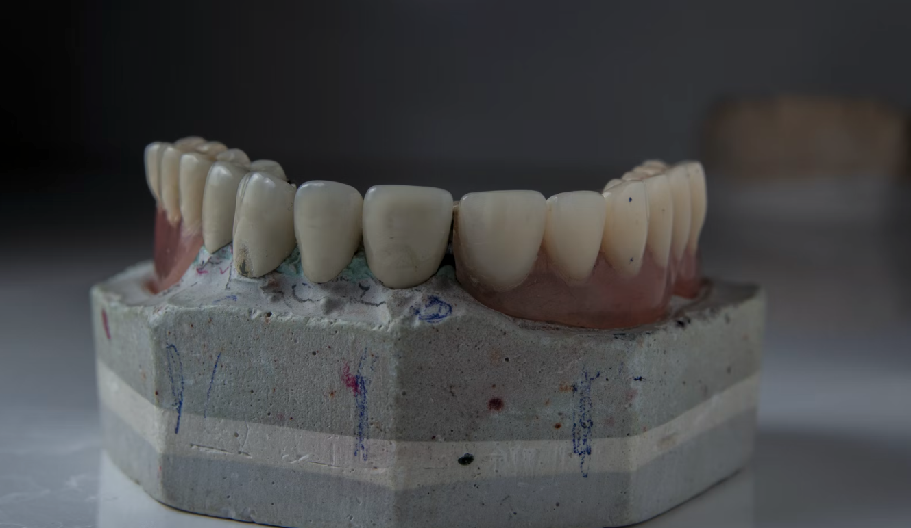
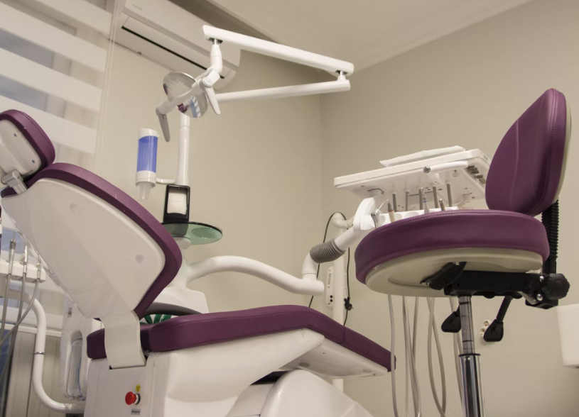

## 結論

- よく調べて良い歯医者を選ぼう
- アメリカで歯の神経を抜く（根管治療）と保険適用で約 4 万円（私の場合）

## 事の始まり

渡米前に歯医者に行って虫歯などがあれば早めに直しておくように。というのよく耳にする先達からのアドバイスではあるが、私もこれに従い、渡米 3 ヶ月前あたりから家から近い歯医者に行き始めた。

photo by Ozkan Guner on [Unsplash](https://unsplash.com/)

歯科医院なんてどこでもそんなに変わらないだろうとレビューをよく確認せずに治療を受けたのがが運の尽き。それほど深くない"はずの"虫歯（場所は左下の奥から 2 番目）の歯を部分的に削って治してもらってセラミックの詰め物（セラミックインレー）をしてもらったまではよかったが、いつまで経っても痛い。（セラミックインレーは保険適用外なので 1 つあたり約 5 万円。）食べ物を噛んだら痛い。噛まなくても痛い。アルコールを飲めばもっと痛い。当初はかみ合わせが合ってないからとかセラミックインレーをつける際の接着剤（のようなもの）が歯にしみているから、痛みを引き起こしているなどと説明され、痛み止めを処方されたが、痛み止めがきれればまた痛くなるというように一向によくならない。その時点で神経が傷ついたのではないかと思ったが、渡米直前にややこしい状況になるのは避けたかったのでその治療を受けた医院で神経の話題は出さなかったし、他の歯科医院にも行かなかった（もし虫歯が神経に達していればかなり痛いはずだが、私自身は冷たいものや甘いものを食べてもしみたりはしていなかった。実際にどれくらい虫歯が深かったかは治療を担当した歯科医にしか分からない。）

## 渡米後

さてそんなこんなで渡米まで&#8212;&mdash;ならましだったのだけれど、新婚旅行で行ったボラボラ島でも、そして残念ながらに 2018 年 10 月に渡米してからも歯の痛みは続き、サンタバーバラのポスドク生活は歯の痛みとともに始まった。（ポスドク生活はまた[別の記事](https://www.yusaito.com/blog/posts/us-life/ucsb-postdoc-memory/)にしようと思う。）この痛みが続いている間は市販の痛み止めの代表である EVE など（実際に使っていたのはその中でも特に強そうな EVE QUICK DX）を 6-8 時間間隔で常に服用していた。アメリカ生活が始まって 1-2 ヶ月くらいは、全く新しい環境で、全く異なる言語での環境で、種々の手続きをしたり装置の使い方を覚えたり、文字通り毎日を生きるのに精一杯で歯の問題に関しては忘れつつあった。当時はよく調べもせずにアメリカの医療費は高いという先入観（日本と比べて高いのはかなり事実）からアメリカの歯科医に行くことは選択肢に入ってなかったし、半年後か 1 年後か次に日本に帰国するときに保険適用外でもどこかましな歯科医に診てもらおうと思っていた。実際に生活に支障が出るほど痛むわけでもないし、そのうち治るんじゃないかという淡い期待さえあった。

事は 2019 年 1 月 11 日に起こった。その日は朝からいつにも増して歯が痛かった。ラボから帰って来たのは夜 10 時ごろ。その帰宅直後に立っていられないくらいの激痛で自分の部屋で蹲ってしまった。例えてみるなら、麻酔なしで歯をドリルで貫通させている感じ。その劇的な痛みが続いたのは 5 分か 10 分くらいで、突然その痛みはかなり和らいだ。そのとき私は、あ、これは神経が逝ったんじゃないかと悟った。とはいっても仕事中にまたこの痛みがきたら作業内容的に危険なので急いで歯の神経を専門に扱っている歯内治療専門医（Endodontist）を検索して、今回はちゃんとレビューにも目を通し、web 上での評判が素晴らしかった[Dr. Patmore](http://www.centerformicrodentistry.com/patmore/)にメールを送って、保険適用可能かどうかだけ聞いて、運良くすぐにアポをとることができた。

## 根管治療を経て

photo by Ozkan Guner on Unsplash

アポをとった当日に訪問し、レントゲン写真をとってもらい、診察を受けると開口一番「こりゃ神経が死んでますね」だった。（多分"Your nerve is dead."みたいな簡単な表現だったのでこの英語だけは聞き取れた。それ以外は専門用語のオンパレード...）根管治療自体は 1 時間程度で終わったと思う。アメリカでの歯科医も神経を抜いたのも全てが人生初で、心の中では後は野となれ山となれ状態だったのでこのあたりの記憶は結構あいまいである。英語の説明は全くわからなかったけれど、治療が終わって会計に進むと保険適用後の治療費が 4 万円というの見て、とりあえずほっとしたのを覚えている。治療費が高いアメリカなら 20-30 万くらいは請求されるんじゃないかと戦々恐々としていたので。ちなみに保険適用前の治療費は 20 万円くらいだった。何はともあれ、治療は無事終了し、この日から歯の痛みから開放されてようやく本当のアメリカ生活が始まった。渡米から既に 3 ヶ月と少し経ったころであった。
