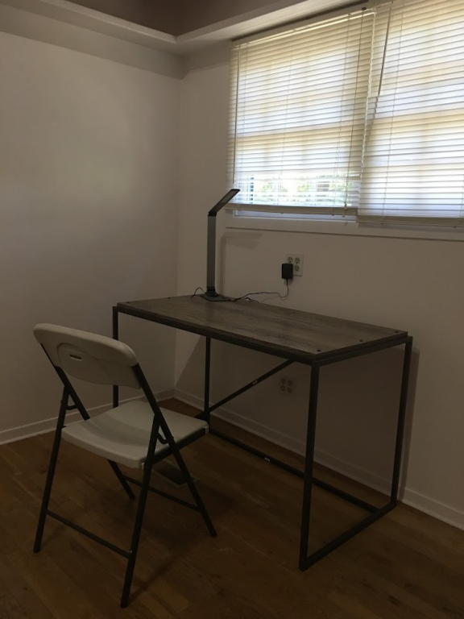
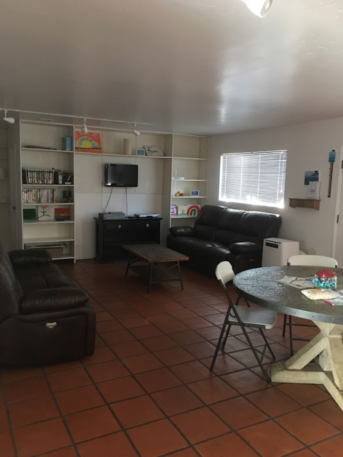

## 渡米直後
渡米直後に最初に住んだ部屋。アイラビスタのTrigo Rdにある7-8人くらいが住めるシェアハウス。同じ時期にICUから交換留学のような制度で女子学生が二人来ていた。彼女達は二人とも英語がペラペラでキャンパスの情報などを時折仕入れてくれたり、時には日本食をプレゼントしてくれたりなどとてもお世話になった。（学部生の彼女達からみたら私は毎日深夜頃にラボから部屋に帰ってくる異様な存在だったのではないかと思う。）

## アイラビスタの街並み
[アイラビスタ](https://ys-blog.hatenadiary.com/entry/2021/08/11/123555)は人口の大半が学生の街である。スケボーに乗ってる人やサーフボードを持ってる人を多数見かける。治安はとても良い。ニューヨークと比べて時間がとてもゆっくり流れていて、穏やかな人が多く、これといった（人種）差別を受けたことは3年間で一度もない。ただし、たまによそ見をしているスケボーダーが突っ込んできたり、スケボーダーが転んだ際にボードがこちらに突っ込んでくることがあるので注意。

## カリフォルニア大学サンタバーバラ校（UCSB）
多分UCSBの正門（キャンパスの東側にある）。めったに使わない。

キャンパス内

## キャンパスビーチ
研究で疲れたときはぼーっとビーチを見ると癒やされる。

## Downtown
赤い屋根が特徴的なスペイン風の美しい建物が多い。ワイナリーや海鮮系のレストランも多い。

サンタバーバラはウニの名産地なので、Sushi Go GoとShell fish companyというお店で妻とウニを食べた。

以下はサンタバーバラ外の場所である。

## チャンネル諸島（Channel island） @ Ventura
チャンネル諸島は、サンタバーバラ近くにベンチュラ郡に属する8つの島々で構成される諸島で国立公園にもなっている。[シマハイイロギツネ(Island fox)](https://www.google.com/search?q=fox+channel+island&sxsrf=ALeKk01Ji-Np7d7ZHCXRcXXliZUxQi_2OA:1627670416849&source=lnms&tbm=isch&sa=X&ved=2ahUKEwiFrofouIvyAhVoFjQIHeY9Ds8Q_AUoAXoECAEQAw&biw=1848&bih=899#imgrc=r5r8yriLmEpykM)という小柄なキツネが多数生息する。かなり人馴れしている。

## リンダウ・ノーベル賞受賞者会議 @ Linadu, Germany
毎年30名程度のノーベル賞受賞者が世界中から招待され、若手研究者（大学院生やポスドク）に対して講演やディスカッションを行って下さる会議でドイツのリンダウで開催されている。
日本人は10名程度参加していた。詳細は[こちら](https://www.jsps.go.jp/j-lindau/)

## The Institute of Photonic Sciences @ Castelldefels, Spain
リンダウの帰りにスペインのカステイダフェルス（Castelldefels）にあるICFO（The Institute of Photonic Sciences）という研究機関の中のDimitri Efetov研を訪問した。Prof. Efetovの大学院時代の研究テーマが私の大学院時代の研究テーマと似た内容だったために興味をもってもらい、大学院時代の研究テーマでセミナーをさせて頂いた。

## ニューヨーク大学 @ NYC
2019年12月頃（covid19が中国で発見されたあたり？）にベクトルマグネット付きの希釈冷凍機を借りるためにニューヨーク大学のJavad Shabani研究室を訪問した。冬のニューヨーク市は極寒で日によってはマイナス10度を下回ったりして顔中凍るかと思った。ニューヨーク市滞在中に体調を崩し、そこそこの熱（38度以上）とひどい咳が出た。これがコロナの症状だったかどうかは今となっては知る由もない。ちなみに実験はうまくいかなかった（サンプルが全滅した）。
 

