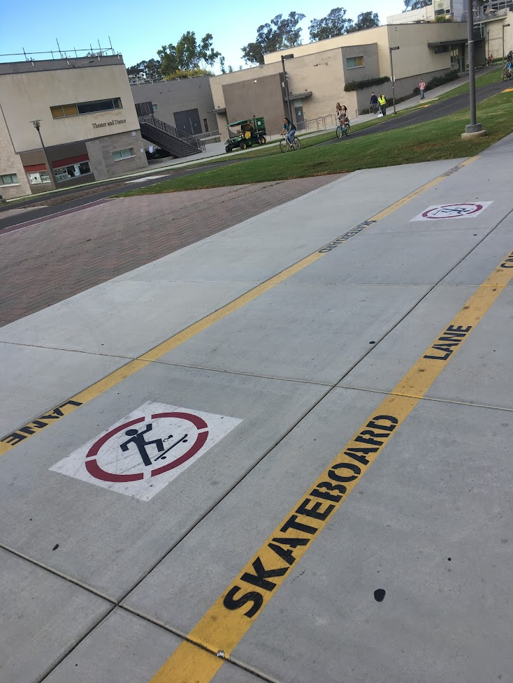
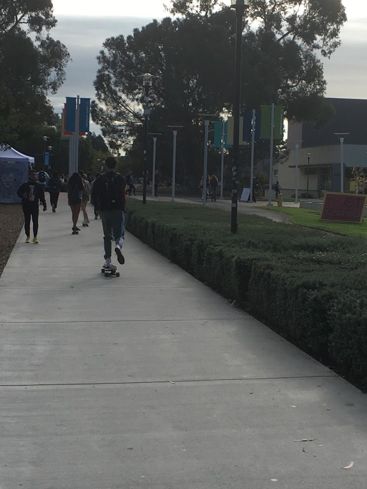

住民の大半が学生で構成されているアイラビスタはカリフォルニア大学サンタバーバラ校（UCSB）のすぐ東側に位置する小さい町である。一年中快晴の地中海性気候（冬に少し雨が降る）のせいか、ビーチ沿いのせいか、学生街だからか、治安はとても良い。ビーチに隣接しているので街中には夏冬関係なく水着姿の学生が散見され、ビーチではサーフィンしている学生も多い（例えばある学生の一日の様子がYoutubeにある＝＞[A Day in My Life at UCSB ](https://www.youtube.com/watch?v=ucyE3Y3Ad5s)）。下記は2021年1月に撮影したアイラビスタのビーチの写真である。(気温は15-20℃くらいだった。)

## デルプラヤ
アイラビスタのデルプラヤ（[Del Playa Drive](https://www.google.com/maps/place/Del+Playa+Dr,+Isla+Vista,+CA+93117/@34.4095932,-119.8638908,15.75z/data=!4m5!3m4!1s0x80e93f43b15062a1:0xd7910189e0609a8f!8m2!3d34.4097664!4d-119.861935)）というビーチ沿いのストリートは現地ではかなり有名で、第３セムスター後の春休み明け（4月頭）になるとデルプラヤと呼ばれる盛大なパーティーが街中で開催される。このパーティーのために、ときにはカリフォルニア中からこの小さい街に学生が集まるとも言われている。このデルトピアのためか、UCSBは全米でも有数のパーティー大学としても有名である。もっともデルプラヤではデルトピアの日に限らずほとんど毎日各家でパーティー（日本で言うところの学生の宅飲みだが、爆音で音楽をかけながら庭で（時として上裸または水着で）謎のテーブルゲームをしながら行う点が異なる）が行われているのでパーティー三昧の学生生活を謳歌したければデルプラヤのどこかに住むのが良いし、そうでなければなるべくデルプラヤから離れた場所に部屋を借りるのが賢明である。ちなみに私は後者を選択した。

## スケボー文化
アイラビスタにはスケボーが自転車並に使われている。平時であれば自転車よりも多くみかけるかもしれない。UCSBキャンパス内にはスケボーの専用レーンがあるほどである。裸足でスケボーに乗っている人もいれば（街中には裸足の人が意外に多い）、サーフボードを抱えながら乗りこなすいたりする。
 
<!-- 

 -->